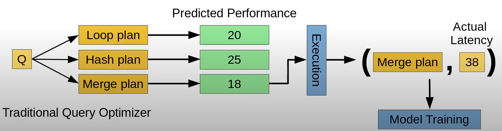
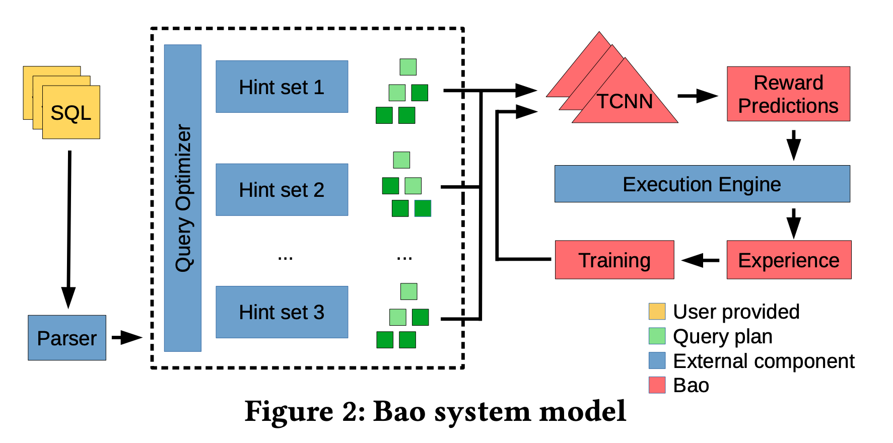
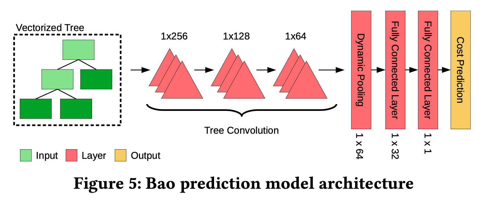
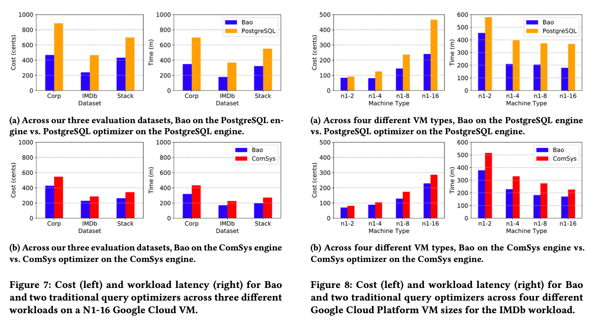

# Publication Review - Bao: Making Learned Query Optimization Practical

### Authors: 
- Ryan Marcus, MIT & Intel Labs <ryanmarcus@csail.mit.edu>
- Nesime Tatbul, MIT & Intel Labs <tatbul@csail.mit.edu>
- Parimarjan Negi, MIT <pnegi@csail.mit.edu>
- Mohammad Alizadeh, MIT <alizadeh@csail.mit.edu>
- Hongzi Mao, MIT <hongzi@csail.mit.edu>
- Tim Kraska, MIT <kraska@csail.mit.edu>

Presented at [SIGMOD ’21, June 20–25, 2021, Virtual - Event, China](https://doi.org/10.1145/3448016.3452838)

### Reviewed for ITEC-6220 by: Firoz Kabir

---
# Problem Description
- Long training time
- Inability to adjust to data and workload changes
- Tail catastrophe
- Black-box decisions
- Integration cost
---

# The Bao difference: 
- Short training time
- Robustness to schema, data, and workload changes
- Better tail latency
- Interpretability and easier debugging
- Low integration cost
- Extensibility

---

# Bao System Model:

---

# Bao Prediction Model: 

---

---

# Questions :question: